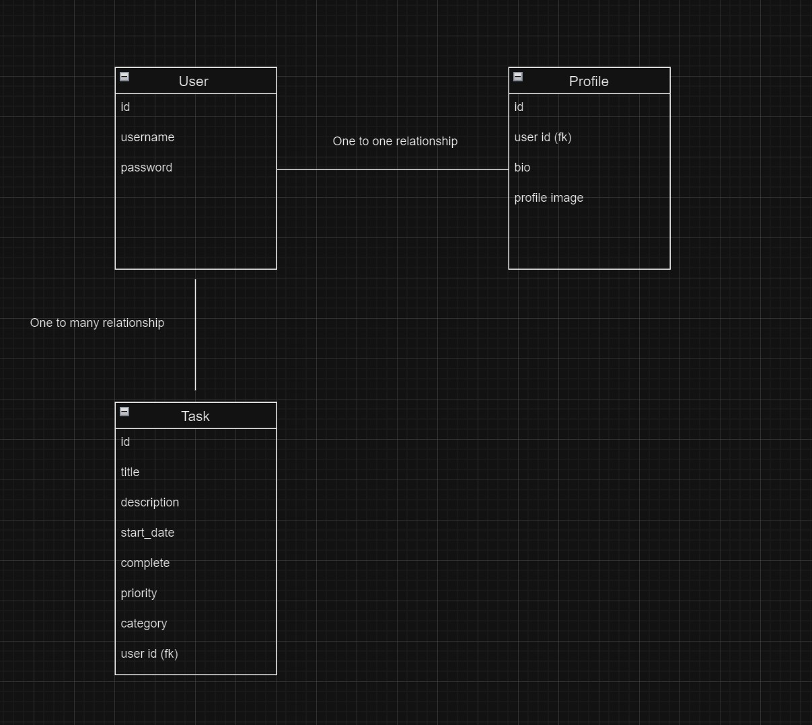
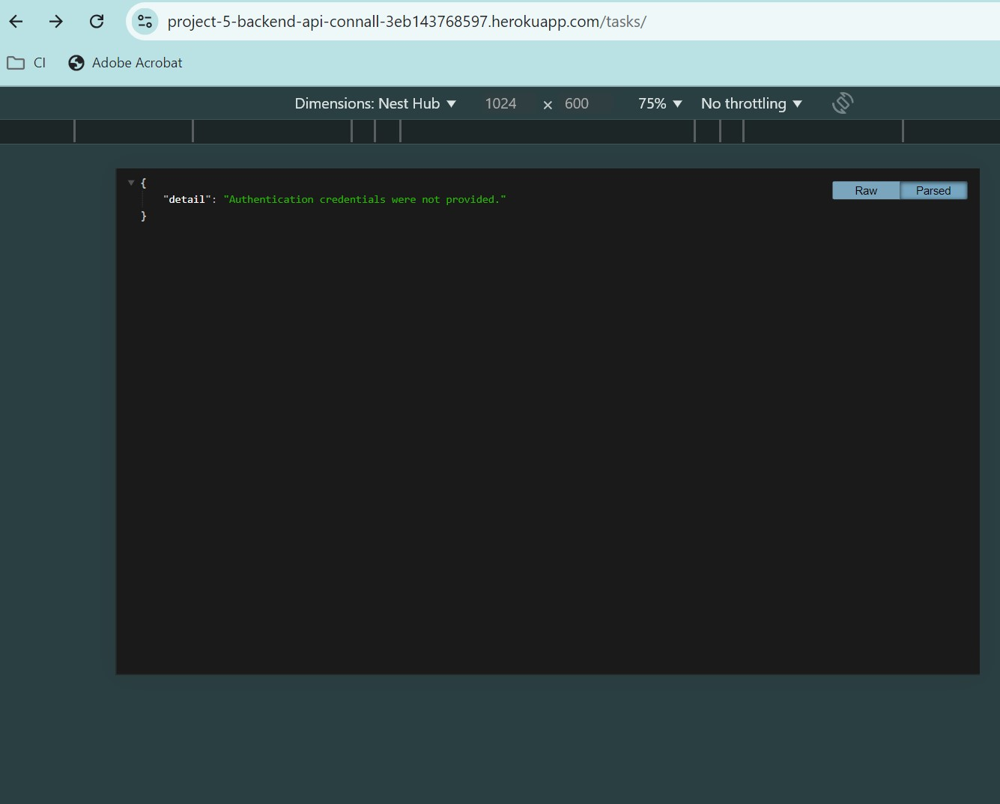
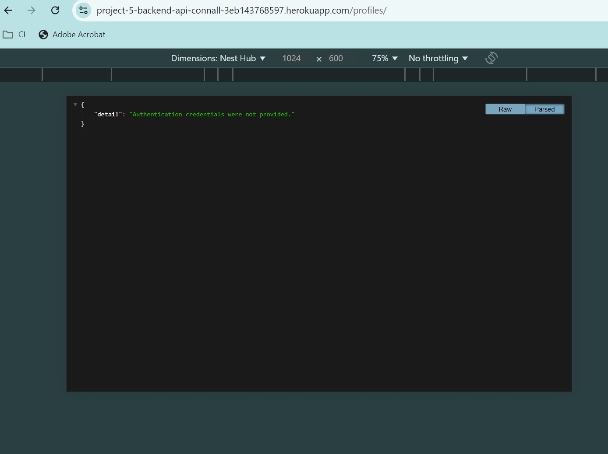
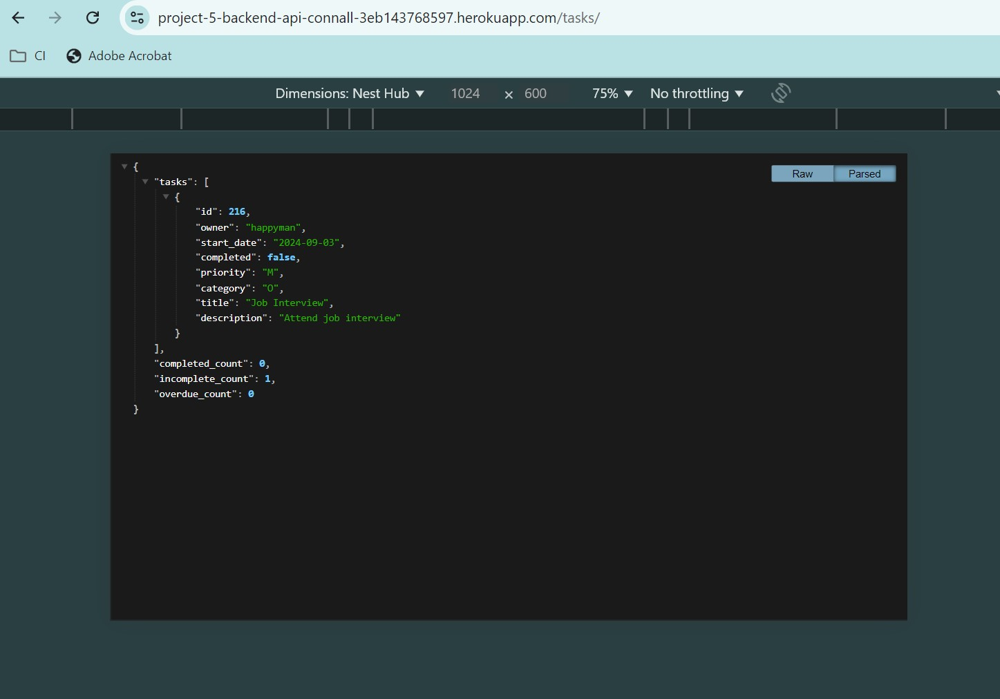
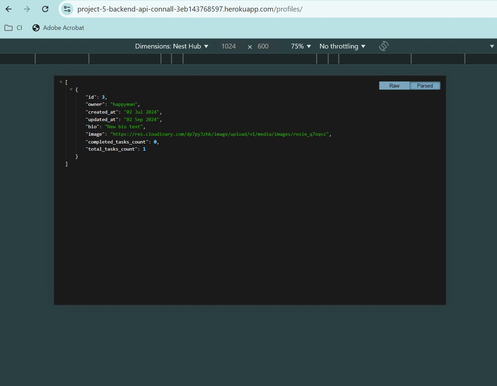

## The Application

Link to the published site [here](https://project-5-backend-api-connall-3eb143768597.herokuapp.com/tasks/)

Please find the Frontend Repo [here](https://github.com/Connall1234/ci-project-5-frontend)

Please find the Backend Repo [here](https://github.com/Connall1234/final-project-backend)

Welcome to OnTrack, a task managing application that lets you create, edit, delete, and tick off tasks during your day. We also feature a profile section where you can change your profile image and your bio, as well as some rewards that you can track along the way.

The purpose of this project was to bring to life a task managing app that would be simple and effective to use, without having too many intricacies to work through.

We wanted to make an application that would be easy to understand right away and be useful to a potential customer.

## Entity-Relationship Diagram

The ER (Entity-Relationship) diagram represents the relationships between the three main models in the Django backend: `User`, `Profile`, and `Task`. 

### Relationships

- **User to Profile: One-to-One (1:1)**
  - The `User` model, provided by Django's authentication system, has a One-to-One relationship with the `Profile` model. This means that each user in the system has one and only one profile, which contains additional information such as a bio and profile image.

- **User to Task: One-to-Many (1:N)**
  - The `User` model has a One-to-Many relationship with the `Task` model. This allows each user to create multiple tasks, where each task is associated with a specific user. The `Task` model includes attributes such as the task title, description, start date, completion status, priority, and category, enabling users to manage and organize their tasks effectively.

The relationships between these models ensure that the system can manage user profiles and tasks in a scalable and organized manner.



## Django Backend Overview

The backend of this application is built using Python and the Django framework. The backend defines three main models: `User`, `Profile`, and `Task`. Each model supports full CRUD (Create, Read, Update, Delete) functionality, enabling users to create and manage their profiles and tasks efficiently. The `User` model, provided by Django's authentication system, handles authentication and associations with both `Profile` and `Task` models.

### Models and Access Control

- **Profile and Task Models**: 
  - The `Profile` model is linked to the `User` model via a One-to-One relationship, storing additional user information such as a bio and profile image.
  - The `Task` model is linked to the `User` model via a One-to-Many relationship, allowing each user to create and manage multiple tasks. Each task contains attributes like title, description, start date, completion status, priority, and category.
  - Additionally, the `Task` model includes an `overdue` boolean value, which is set to `True` if the current date has passed the task's start date without the task being marked as completed. Tasks also have a `completed` boolean value that indicates whether or not the task has been finished. These fields help users track their task progress and manage overdue tasks effectively.

### Access Control

- **Superuser Access**: 
  - The superuser, who is created during the Django setup, has full access to all profiles and tasks in the system. This allows the superuser to view, edit, and delete any user’s profile or task, providing complete administrative control over the backend.

- **Standard User Access**: 
  - Apart from the superuser, standard users can only access their own profiles and tasks. Users are restricted from accessing or modifying the profiles and tasks of other users. This access control is enforced by Django’s authentication and permission system, ensuring that user data remains secure and private.

## Backend Testing

### Access Control Testing

We conducted a series of tests to ensure that access control is properly enforced on both the profiles and tasks endpoints. These tests were designed to verify that users cannot access data unless they are authenticated and that they can only view their own data once logged in.

#### 1. Access Without Authentication
- **Test Description**: Attempted to access the `/profiles` and `/tasks` endpoints without being logged in.
- **Expected Outcome**: The system should return a 401 Unauthorized response, blocking access to these resources.
- **Result**: As expected, the system successfully blocked access, returning the appropriate 401 status code.





#### 2. Access With Authentication
- **Test Description**: Logged in as a user and attempted to access the `/profiles` and `/tasks` endpoints.
- **Expected Outcome**: The user should only be able to view their own profile and tasks.
- **Result**: Upon authentication, the system allowed access to the user's profile and tasks, but no other users' data was accessible.





### Summary

These tests confirmed that the backend correctly enforces authentication and authorization rules, ensuring that user data is secure and private.

## Deployment Guide: React Frontend with Django Backend on Heroku

This guide outlines the steps to deploy your full-stack application, which includes a React frontend and a Django backend, to Heroku. The React frontend communicates with the Django backend via Axios.

### Prerequisites

Before you start, ensure you have the following:
- A [Heroku](https://heroku.com) account
- Heroku CLI installed
- Git installed
- Node.js and Python installed on your machine
- A PostgreSQL database (Heroku provides one in production)

### 1. Set Up Your Django Backend for Deployment

1. Install necessary packages, such as Gunicorn (for serving your Django app) and Whitenoise (for handling static files).
2. Update the `settings.py` file:
   - Configure `ALLOWED_HOSTS` for production.
   - Set up static file handling using Whitenoise.
   - Configure the database to use PostgreSQL in production (use `dj-database-url`).
3. Create a `Procfile` in the root directory to specify the command to run your application (e.g., using Gunicorn).
4. Add env.py file to your gitignore so any secret keys aren't shared.
5. Collect static files for production.

### 2. Set Up Your React Frontend for Deployment

1. In your React project, update the Axios base URL to point to the production Django backend API.
2. Build the React project using `npm run build` or `yarn build`. This generates static files for deployment.
3. Ensure your React app is configured to handle routing properly on Heroku (e.g., using `BrowserRouter`).

### 3. Prepare for Deployment on Heroku

1. Create a Heroku app using the Heroku CLI:  
   ```bash
   heroku create your-app-name

## Credits

I would like to extend my gratitude to the following individuals and organizations for their invaluable support during this project:

- **Code Institute**: Thank you for your assistance and for the guidance provided through the Moments project. Your resources and support have been instrumental in the development of this application.

- **ChatGPT**: I appreciate the help with writing the "About" section of the application and for assistance with debugging. Your insights and suggestions have greatly enhanced the quality of this project.

- **My Mentor**: A special thank you to my mentor for their continuous support and guidance throughout this project. Your expertise and feedback have been crucial to its success.
